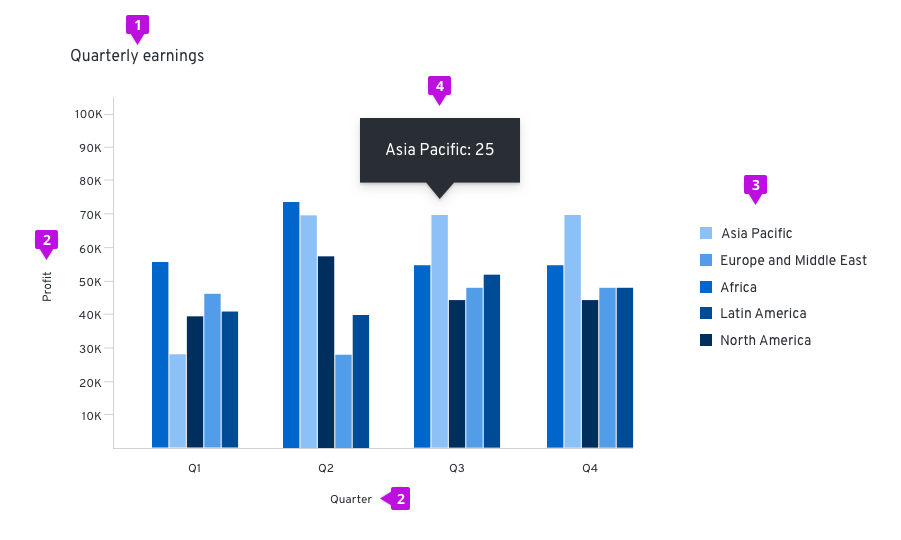
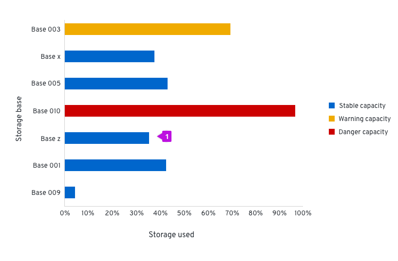
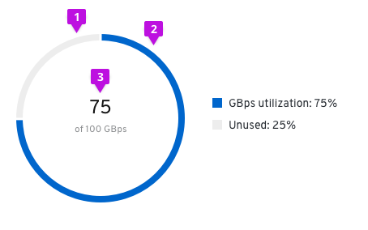
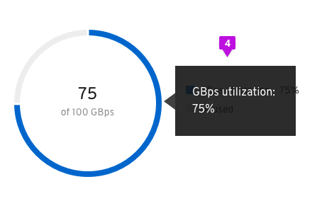
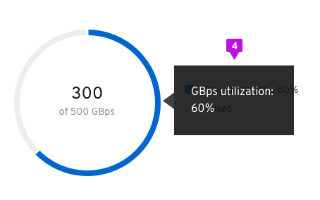
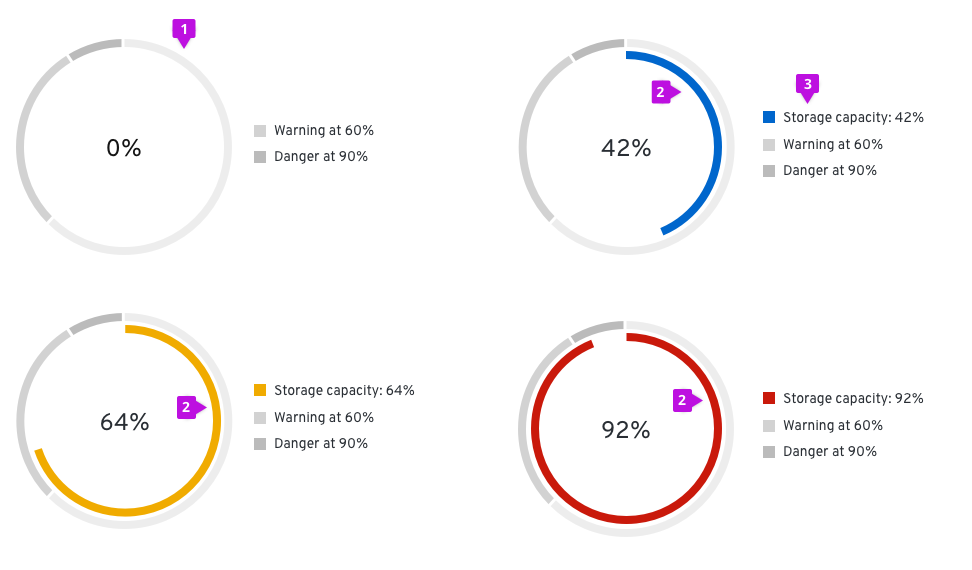
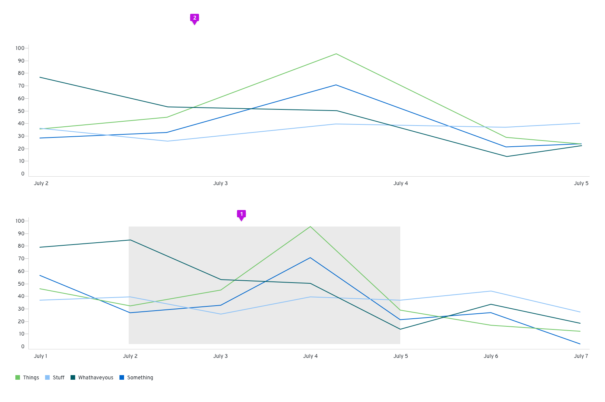

# Charts
_Charts are only available in React_

Use charts to visualize data in an application. The type of chart you use will depend on your use case and the type of data you need to display.

## Elements

1. **Title**: Titles should be left-aligned and appear above your chart.
2. **Axis labels and scale values**:  We recommend using tick marks to clearly mark scale values on the y-axis. The text for axis labels and scale values should be 12px font in standard text color. All scale values should be equally distributed across the axis and the axis label should fall outside the scale values, centered with the axis line.
3. **Legends**: We recommend using legends when charts include more than one variable and therefore use more than one color. If space is not available to display names of horizontal and vertical axes, a legend must be added instead. The legend should list the colors that each variable obtains and the name of the variable. The text on the legend should be 14px size and standard text color. They can either be placed left-aligned to the right of the chart or centered below the chart.
4. **Chart tooltip**: A tooltip will appear on hover over certain elements of a chart, like bars in a bar chart or segments in a donut chart. Chart tooltips should display the specific values related to the element the user is hovering over.

## Chart types
- [Area charts](#area-chart): use to show trending over a continuous scale (usually time)
- [Bar charts](#bar-chart): great way to show and compare categorical data
  - [Stacked bar charts](#stacked-bar-chart)
- [Donut charts](#donut-chart): use to show the relationship of a set of values to a whole or progress completion as a percentages
  - [Donut utilization](#donut-chart-utilization): use to show utilization for an object as a percentages
  - [Donut utilization with threshold](#donut-chart-utilization-with-threshold)
- [Line chart](#line-chart): use to compare several data sets, or to show data over a period of time
- [Pie chart](#pie-chart): show percentages or proportional data

### Area chart
An area chart is used to provide metrics for a single data point. While similar to a line chart in both form and function, it offers an area fill for visual emphasis. The area fill below the line also functions to indicate cumulative data.

#### Usage
The most common use case for area charts is to show trending over a continuous scale (usually time). Use this instead of a line chart when you need to provide more visual emphasis than a simple line chart would offer. It is possible to stack area charts to compare more than one continuous data sets. See [Line charts](#line-chart) for more information about them.

#### Example

1. **Data area fill**: The area fill is presented below the data line. Data area fills use colors that conform with the [Colors for charts](/design-guidelines/styles/chart-colors).
2. **Chart tooltip**: Use the chart tooltip to drill into the data related to any data point provided on your area chart.

#### React component
[Area chart](/documentation/react/charts/chartarea)

### Bar chart

Bar charts are used to visualize and compare categorical data.

#### Usage
Since bar charts differentiate by length, we recommend that in most cases they be used rather than donut or pie charts, which differentiate by angle and area. As a rule of thumb, bar charts are a great way to show and compare categorical data. If you want to show continuous data over time, you may consider using a [Line chart](#line-chart) instead. If you wish to show the percentage utilization ratio between used and available, you should check out the [Utilization donut chart](/documentation/react/charts/chartdonututilization).

#### Horizontal vs. vertical bar charts

The orientation of bar charts is dependent on the data and space at hand. Any bar chart should be able to be displayed in either direction if applicable.

#### Example

1. **Bar**: All bars should be the same width. The height of the bar represents its value. The spacing between bars should be equal as well, mimicking the axis value spacing. For recommendations on fill colors, see [Colors for charts](/design-guidelines/styles/chart-colors).

#### React component
[Bar chart](/documentation/react/charts/chartbar)

### Stacked bar charts

Stacked bar charts describe totals while allowing a degree of internal breakdown of the data. An advantage of stacked bar charts is the order of the stack can be swapped without changing the overall total. These can be illustrated vertically and horizontally depending on available space and the data being described.

#### Example

1. **Stacked bar**: The first series name is represented by the topmost stacked bar, and the last series name is represented by the bottommost stacked bar. For recommendations on series colors, see [Colors for charts](/design-guidelines/styles/chart-colors).

#### React component
[Stacked bar chart](/documentation/react/charts/chartstack)

### Donut chart
These are the most common use cases for donut charts:
- Showing the relationship of a set of values to a whole
- Showing utilization for an object as a percentage (with or without thresholds)

If you need to compare one category to another, consider using a [Bar chart](#bar-chart).

#### Usage
In donut charts, you can choose to use percentages or integer values to compare parts to the whole. When deciding which to use, consider the information that is most important to your user and what makes the most sense for your use case. For example, if a user knows they have 123 farm animals and they’re interested in knowing how many of those animals are cows, it probably makes more sense to use an integer value. If that same user is interested in knowing how much storage space they have left in their grain silo, a percentage might be better.

For donut charts, don’t try to represent more than six categories. We recommend using the [Colors for charts](/design-guidelines/styles/chart-colors) guidelines to represent your data when thresholds are not present.

#### Example

1. **Segment fill**: We recommend using [Colors for charts] (/design-guidelines/styles/chart-colors) for different items within the donut chart.
2. **Segment padding**:  Always provide 3px of padding between segments.
3. **Chart tooltip**: A tooltip will appear upon hover that states the name of the segment and corresponding value. For example, if the segment represents “Bugs,” and the value being represented is 25, your chart tooltip would state, “Bugs: 25.”
4. **Label**: When the Donut Chart is contained within a dashboard card, there is a label defining what the Donut Chart represents. The label may also represent the total value of the data set. If this optional representation is chosen, it should follow the format of [total numeric value] + [data set label]. The total numeric value should be rounded to two decimal places or less (14 characters max) and should be styled using 24px font in standard text color. The data set label cannot contain more than 24 characters and should be styled using 14px font in secondary text color. They are to be centered within the donut and styled as shown. If the label exceeds the max character count, place it outside of the donut and leave the center empty.
5. **Legend**: In order to be compliant with accessibility guidelines, a legend is necessary. Each variable on the legend should report their current value.

#### React component
[Donut chart](/documentation/react/charts/chartdonut)

### Donut chart - Utilization
 

1. **Unused segment fill**: The unused area of the donut chart will always remain at #EDEDED.
2. **Used segment fill**: We recommend using #0066cc for the used area of the donut chart. See [Colors for charts](/design-guidelines/styles/chart-colors) for other recommended color options.
3. **Utilization label**: Both percentages and whole numbers can be used to represent the utilization.
4. **Chart tooltip**: Since this is a utilization donut chart, the tooltip will display the percentage of data utilized. Chart tooltips only appear on hover over the utilization segment of the chart. We recommend stating the segment name and the utilization value being captured. For example, if the user is tracking GBps utilization, the chart tooltip would state “GBps utilization: 75%.”

#### React component
[Donut utilization](/documentation/react/charts/chartdonututilization)

### Donut chart - Utilization with threshold

1. **Threshold segment fill**: The outer segments of the chart are static and represent the thresholds for your use case. The example diagrams show utilization thresholds for a database and are used to let users know when they move from a safe zone into a danger zone. For threshold segments, use incremental shades of  grey starting at #EDEDED then to #D2D2D2 then to #BBBBBB. Provide 3px of padding between each segment.
2. **Utilization segment fill**: This dynamic chart is a concentric circle within the donut thresholds and will represent the data set. For this chart, we recommend using the following colors:
  - #0066cc before the data set has hit a threshold
  - #F0AB00 once the data set has hit the warning threshold
  - #C9190B once the data set has hit the danger threshold
3. **Legend**: The utilization segment color swatch will change in accordance to the chart.

4. **Chart tooltip**: Chart tooltips appear on hover for both threshold segments and utilization segments. We recommend stating the threshold name, the segment name, and the value being represented. For example, if the threshold being met is “Danger,” and the segment represents “Storage capacity,” and the value being represented is 92%, your chart tooltip would state, “Danger: Storage capacity: 92%.” We recommend stating the threshold name “at” the percentage the threshold begins (ex. Warning at 60%).

#### React component
[Donut utilization](/documentation/react/charts/chartdonututilization/#donut-utilization-chart-with-static-thresholds)

### Line chart

A line chart plot a series of discrete data samples that are good for showing continuous data and trend information. Sample values on the line can be measured and extracted.

#### Usage
The most common use case for line charts is to compare several data sets over a period of time. They can be used to project trends into the past or future. A best fit line is created and extended in both directions to do so, but the validity of the projection is not certain. If you want to show and compare categorical data, you may consider using a bar chart.

Multiple lines on the same chart allow the user to visualize relationships between varying data sets, such as correlated events, similarities or unexpected differences. We recommend displaying no more than 6 lines on a single graph to avoid confusion.

#### Example

1. **Line**: Line charts can optionally visually represent data points as dots on the line. If so, the same interaction that occurs when hovering over one in an [Area chart](#area-chart) will occur in line charts. For line colors, we recommend using the [Colors for charts](/design-guidelines/styles/chart-colors).

### React component
[Line chart](/documentation/react/charts/chartline)

### Pie chart

Pie charts are commonly used to show percentages or proportional data.

#### Usage
It makes sense to choose a pie chart when you need to compare a set of values to a whole. For example, you might choose a pie chart when visualizing the number of sales made by a team of five people; each segment of the chart represents one salesperson’s performance in the context of the rest of the team. The sum of all of the segments of the chart must equal 100%, and the data points should be mutually exclusive. It is recommended that there are no more than six segments per single pie chart.

A pie chart may be the wrong choice when you need to compare categories to one another, because it can be difficult to distinguish small differences between segments. If you wish to compare values to each other, the [Bar chart](#bar-chart) may be a more effective pattern.

#### Example

1. **Pie chart fill**: We recommend that fill colors should be based on the [Colors for charts](/design-guidelines/styles/chart-colors).
2. **Legend**: Each variable on the legend should report their current value.

### React component
[Pie chart](/documentation/react/charts/chartpie)

### Charts in cards
If a chart lives in a card, the title of that chart will be placed on the header of that card instead of the chart. The rest of the chart guidelines should be followed for the chart itself.

### Brush and zoom
The brush and zoom properties allow for magnification of an area, bar, line or stack chart. If desired, more advanced features can be added through [Victory](https://formidable.com/open-source/victory/guides/brush-and-zoom/).

#### Example

1. **Window**: Click and drag to create a window around the section of the chart that you want to zoom in on
2. **Magnified chart**: The portion selected will appear above the full chart view.
